# soal-shift-sisop-modul-3-F04-2021

# Anggota Kelompok
- **Thomas Dwi Awaka** (05111940000021)
- **Muhammad Arifiansyah** (05111940000027)
- **Muhammad Rizqullah Akbar** (05111940000178)

# Pembahasan Soal
## Soal 1
Keverk adalah orang yang cukup ambisius dan terkenal di angkatannya. Sebelum dia menjadi ketua departemen di HMTC, dia pernah mengerjakan suatu proyek dimana keverk tersebut meminta untuk membuat server database buku. Proyek ini diminta agar dapat digunakan oleh pemilik aplikasi dan diharapkan bantuannya dari pengguna aplikasi ini. 
### Soal 1a
Membuat program untuk login dan register user, penggunaan _Socket Programming_ sangat digunakan untuk komunikasi user dengan client,penggunaan _struct_ sangat berperan penting dalam menyimpan isi file yang di _read_.Login sangat penting digunakan untuk


## Soal 2
Crypto adalah teman Loba. Suatu pagi, Crypto melihat Loba yang sedang kewalahan mengerjakan tugas dari bosnya. Karena Crypto adalah orang yang sangat menyukai tantangan, dia ingin membantu Loba mengerjakan tugasnya. Detil dari tugas tersebut adalah:
### Soal 2a
Membuat program perkalian matriks (4x3 dengan 3x6) dan menampilkan hasilnya. Matriks nantinya akan berisi angka 1 hingga 20. Hasil perkalian dari kedua matrix ini akan dipakai di **soal 2b**,sehingga perlu memakai _shared memory_ agar hasil perkalian tersebut dapat digunakan pada soal 2b.
_Shared memory_ pada soal 2a dimulai dengan menciptakan _segment memory_ (`shmget()`) & meng-_attach_ variabel yang akan digunakan (`shmat()`).
```C
    key_t key = 1234;
    int *value, *wait=0;

    int shmid = shmget(key, sizeof(int), IPC_CREAT | 0666);
    value = shmat(shmid, NULL, 0);
    wait= shmat(shmid, NULL, 0);
```
- `value` akan menyimpan nilai dari hasil perkalian dari dua matrix di _shared memory_.
- `wait` akan menjadi indikator bahwa __soal 2b__ telah selesai menggunakan `value`. `wait` bernilai awal 0

Kemudian dilakukan proses memasukan nilai dari matriks 4x3 & 3x6 seperti berikut
```C
    printf("matrix 1:\n");
    for(i=0; i < 4; i++){
        for(j=0; j < 3; j++) scanf("%d", &mtx1[i][j]);
    }
    printf("matrix 2:\n");
    for(i=0; i < 3; i++){
        for(j=0; j < 6; j++) scanf("%d", &mtx2[i][j]);
    } printf("\n");
```
Setelah itu mengalikan kedua matrix tersebut dan disimpan di `value` dalam bentuk _array 1D_. Dan untuk menyesuaikan posisi setiap nilai dari matrix 2D ke matrix 1D dapat memakai rumusan `loop_baris x total_kolom + loop_kolom`.
```C
    for(i=0; i < 4;i ++){
        for(j=0; j < 6; j++){
            for (k = 0; k < 3; k++){ // mengalikan kedua matrix
                temp += mtx1[i][k] * mtx2[k][j]; 
				}
            value[i*6 + j] = temp; //memasukan nilai ke value
            temp=0;
        }
    } 
```
Hasil dari perkalian kedua matriks dapat diliat dengan looping sebagai berikut
```C
    printf("hasil:\n");
        for(i=0; i < 4;i ++){
            for(j=0; j < 6; j++){
                printf("%d ", value[i*6 + j]);
        }printf("\n");
    }
```
Agar program ```soal2a.c``` dapat tetap aktif, dilakukan looping `while` dan `sleep()` hingga nilai dari `wait` bernilai 1.
```C
    while(1){
		if (*wait == 1){printf("soal2b.c done!\n"); break;}
		printf("waiting...\n"); sleep(3);
	}
```
jika soal 2b telah selesai berjalan. `value` dan `wait` dapat dilepas/_detach_ dari _shared memory_ yang tersedia dengan cara
```C
    shmdt(value);
    shmdt(wait);
```
dan dilakukan proses control terhadap _shared memory_ dengan `smctl`. Proses yang dilakukan adalah `IPC_RMID`. Proses ini menghapus/_remove_ _shared memory_ berdasarkan `smid` yang tadi diperoleh pada saat menciptakan _segment memory_.
```C
shmctl(shmid, IPC_RMID, NULL);
```
### Soal 2b
Membuat program dengan menggunakan matriks output dariprogram soal2a.c. Kemudian matriks tersebut akan dilakukan perhitungan dengan matrix baru (input user) sebagai berikut contoh perhitungan untuk matriks yang ada. Perhitungannya adalah setiap cel yang berasal dari matriks A menjadi angka untuk faktorial, lalu cel dari matriks B menjadi batas maksimal faktorialnya. Perhitungan setiap cel menggunakan `thread`.

Sama seperti soal 2a, terlebih dahulu menciptakan _segment memory_ (`shmget()`) & meng-_attach_ variabel yang akan digunakan (`shmat()`). `value` akan menyimpan nilai dari hasil perkalian dari dua matrix di _shared memory_. `wait` akan menjadi indikator bahwa __soal 2b__ telah selesai menggunakan `value`. `wait` bernilai awal 0.
Setelah menciptakan _segment memory_, program dapat menerima input untuk matriks 4x6 yang baru dalam bentuk _array 1D_, karena menyesuaikan dengan `value` yang berbentuk _array 1D_.
```C
    printf("mtx3:\n");
    for(i = 0; i < 24; i++) scanf("%d", &mtx3[i]);
```
Kemudian matriks baru tersebut menjalankan perhitingan faktorial dengan menggunakan thread. Dimulai dengan membuat thread/`pthread_create()` terlebih dahulu dengan:
- `tid1[]` digunakan untuk menunjukkan alamat memori dengan thread ID dari thread baru & inisialisasi array untuk menampung thread
- nilai attr di-set __NULL__ agar thread menggunakan atribut default.
- Thread yang baru dibuat akan berjalan dimulai dari fungsi factorial() dalam fungsi thread.
- Pointer `address` digunakan untuk memberikan sebuah argumen ke fungsi factorial()

Dan dengan `pthread_join(tid1[address], NULL)` untuk memastikan bahwa thread `tid1[address]` berhasil berhenti dan mengembalikan nilai NULL jika berhasil berhenti.
```C
    #include <pthread.h>
    pthread_t tid1[24];
...
    for(i = 0; i < 4; i++){
        for(j = 0; j < 6; j++){
            address = i*6+j; //posisi array 1D
            pthread_create(&(tid1[address]), NULL, 
            &factorial, (void *) &address);
            pthread_join(tid1[address], NULL);
        }
    }
```
Untuk proses perhitungan faktorial dari kedua matriks ini perlu memperhatikan beberapa syarat:
- jika nilai cel matriks `value` >= matriks baru, maka hasil faktorial = value!/(value-baru)!
- jika nilai cel matriks baru > matriks `value` , maka hasil faktorial = value!
- jika nilai cel matriks `value` = 0, maka hasil faktorial = 0

`*arg` yang di-_passing_ dari `pthread_create()` berisi posisi dari cel yang akan dihitung, yaitu `i*6+j` dan hasil faktorial disimpan di array 1D `ans[]`
```C
    void* factorial(void *arg){
        int *addressTemp = (int*) arg;
        if(value[*addressTemp] >= mtx3[*addressTemp]){
            ans[*addressTemp] +=             factcal(value[*addressTemp])/factcal(value[*addressTemp]-mtx3[*addressTemp]);
        }
        else if (value[*addressTemp] < mtx3[*addressTemp]){
            ans[*addressTemp] += factcal(value[*addressTemp]);
        } else ans[*addressTemp] = 0;
    }
```
terdapat fungsi rekursif `factcal()` untung menghitunga faktorial dari nilai yang dipakai
```C
    unsigned long factcal(int n){
        return (n>=1) ? n*factcal(n-1) : 1;
    }
```
Setelah menyelesaikan perhitungan faktorial, maka hasil tersebut dapat dicetak.
```C
    printf("\nhasil fact:\n");
    for(int i = 0; i < 4  ; i++){
    	for(int j = 0; j < 6; j++){
	    	printf("%lu ", ans[i*6+j]);
	    }
    	printf("\n");
    }
```
Ketika soal2b.c telah selesai menggunakan nilai dari `value`, maka nilai `*wait` dirubah menjadi 1 agar menginfokan soal2a.c bahwa soal2b.c telah selesai. `value` dan `wait` dapat dilepas/detach dari shared memory yang tersedia dengan cara
```C
    *wait = 1;
    shmdt(value);
    shmdt(wait);
    shmctl(shmid, IPC_RMID, NULL);
```
### Soal 2c
Karena takut _lag_ dalam pengerjaannya membantu Loba, Crypto juga membuat program __IPC Pipes__ untuk mengecek 5 proses teratas apa saja yang memakan resource komputernya dengan command `ps -aux | sort -nrk 3,3 | head -5`

Soal ini juga memakai konsep ` fork parent-child` untuk membantu menjalan kan _command_ tersebut.
Program dapat diawali dengan menginisiasi __dua _pipes___ dan memastikan bahwa tidak gagal saat inisiasi
```C
    int fp1[2], fp2[2];
    if (pipe(fp1)==-1){
        fprintf(stderr, "Pipe Failed" );
        return 1;
    }

    if (pipe(fp2)==-1){
        fprintf(stderr, "Pipe Failed" );
        return 1;
    }
```
Setelah berhasil menginisiasi kedua _pipe_ tersebut, maka dapat memanggil fungsi `fork()` untuk menjalankan _command_ tersebut
```C
    pid_t child_id;
    child_id = fork();
    if (child_id < 0) {
        exit(EXIT_FAILURE);
    }

    if (child_id == 0) {
    ...
    }
    else {
    ...
    }
```
Pada `fork()` pertama, child pertama akan menjalankan _command_ `ps -aux`, menutup _read pipe 1_ `fp1[0]`, dan menduplikasi _write pipe 1_ `fp1[1]` ke `STDOUT_FILENO` agar tetap terhubung dengan proses berikutnya
```C
    if (child_id == 0) {
        close(fp1[0]); // read ditutup
        dup2(fp1[1], STDOUT_FILENO);
        char *argv[] = {"ps", "-aux", NULL};
        execv("/bin/ps", argv);
    }
```
Setelah proses _child_ pertama selesai, proses parent akan melakukan `fork()` lagi dan membuat child kedua yang akan menjalankan _command_ `sort -nrk 3,3`. _write pipe 1_ `fp1[1]` & _read pipe 2_ `fp2[0]` ditutup. File descriptor `fp1[0]` diduplikasi ke `STDIN_FILENO` & `fp2[1]` diduplikasi ke `STDOUT_FILENO` agar tetap terhubung dengan proses berikutnya
```C
    else {  // this is parent
        while ((wait(&status)) > 0);
        child_id = fork();
        if (child_id < 0) {
            exit(EXIT_FAILURE);
        }
        if (child_id == 0){
            close(fp1[1]); // write ditutup
            dup2(fp1[0], STDIN_FILENO);
            close(fp2[0]); // read ditutup
            dup2(fp2[1], STDOUT_FILENO);
            char *argv1[] = {"sort", "-nrk", "3,3", NULL};
	        execv("/usr/bin/sort", argv1);
        }
    }
```
parent dari child kedua ini akan menjalankan command terakhir, yaitu `head -5`. _write pipe 1_ `fp1[1]` & _write pipe 2_ `fp2[1]` ditutup. File descriptor `fp2[0]` diduplikasi ke `STDIN_FILENO`
```C
    else{
        close(fp1[1]); // write ditutup
        while ((wait(&status2)) > 0);
        close(fp2[1]); // write ditutup
        dup2(fp2[0], STDIN_FILENO);
        char *argv2[] = {"head", "-5", NULL};
	    execv("/usr/bin/head", argv2);
  }
```
### Output
#### Soal 2a
Proses memasukankan nilai setiap matriks
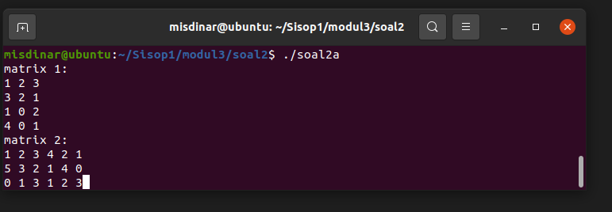

Hasil perkalian matriks dan _looping_ yang berjalan hingga soal 2b selesai
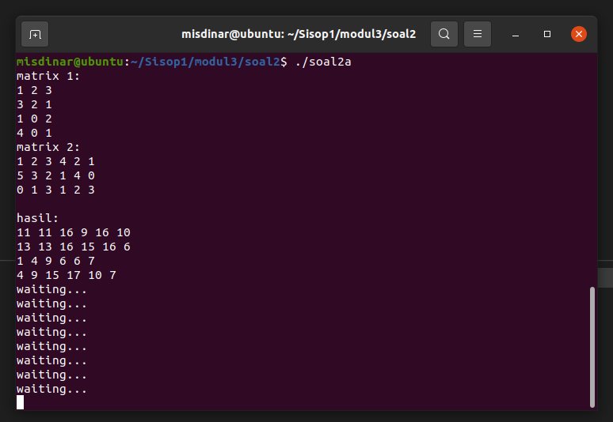
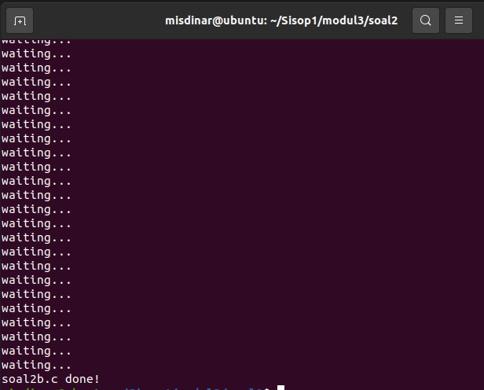
#### Soal 2b
Proses memasukankan nilai setiap matriks yang baru
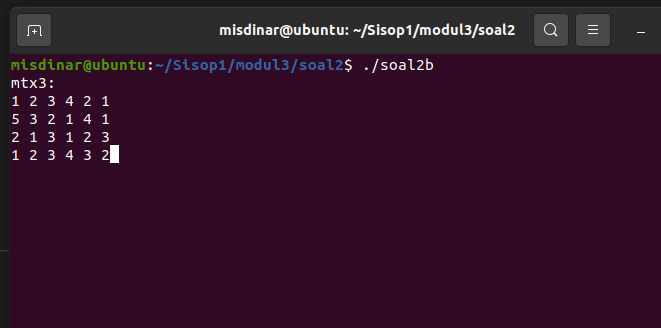

Hasil perhitungan faktorial setiap cel pada matriks
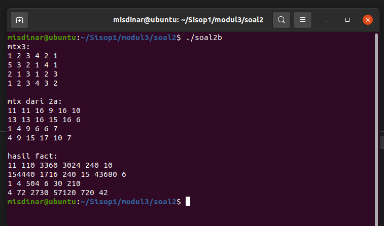
#### Soal 2c
Output dari `soal2c.c`
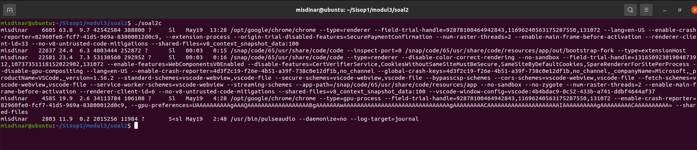
### Kendala
Sempat kebingungan untuk menentukan pipe yang di-`close()` dan penggunaan `dup2()`

## Soal 3
Seorang mahasiswa bernama Alex sedang mengalami masa gabut. Di saat masa
gabutnya, ia memikirkan untuk merapikan sejumlah file yang ada di laptopnya. Karena jumlah filenya terlalu banyak, Alex meminta saran ke Ayub. Ayub menyarankan untuk membuat sebuah program C agar file-file dapat dikategorikan. Program ini akan memindahkan file sesuai ekstensinya ke dalam folder sesuai ekstensinya yang folder hasilnya terdapat di working directory ketika program kategori tersebut dijalankan.
### Soal 3a
Program menerima opsi -f seperti contoh di atas, jadi pengguna bisa menambahkan argumen file yang bisa dikategorikan sebanyak yang diinginkan oleh pengguna.
```c
if (argc > 2 && strcmp(argv[1], "-f") == 0)
    {
        int length = argc - 2;
        pthread_t tid[length];
        int count = 0;
        for (int i = 2; i < argc; i++)
        {
            if (access(argv[i], F_OK) == 0)
            {
                pthread_create(&tid[count], NULL, categorizeFile, (void *)argv[i]);
                count++;
                printf("File %d : Berhasil dikategorikan\n", i - 1);
            }
            else
            {
                printf("File %d : Sad, gagal :(\n", i - 1);
            }
        }
        for (int i = 0; i < count; i++)
            pthread_join(tid[i], NULL);
        return 0;
    }
```
Pertama dilakukan pengecekan opsi yang dipilih pada `argv[1]` setelah itu dilakukan perulangan dari `argv[2]` hingga argumen terakhir, untuk dibuatkan thread untuk mengkategorikan file dan disimpan di *working directory* menggunakan fungsi `categorizeFile()`. Sebelum itu dilakukan pengecekan apakah argumen yang diberikan merupakan file yang valid.
Setelah itu dilakukan `pthread_join` sejumlah thread yang dibuat.
```c
void *categorizeFile(void *arg)
{
    char *src = (char *)arg;
    char srcPath[150];
    memcpy(srcPath, (char *)arg, 400);
    char *srcExt = getExt(src);
    char ext[400];
    strcpy(ext, srcExt);

    DIR *dir = opendir(srcExt);
    if (dir)
        closedir(dir);
    else if (ENOENT == errno)
        mkdir(srcExt, 0777);

    char *srcName = getName(srcPath);
    char *cwd = getenv("PWD");

    char destPath[10000];
    sprintf(destPath, "%s/%s/%s", cwd, ext, srcName);
    rename(srcPath, destPath);
}
```
Pada `categorizeFile()` berfungsi untuk memanggil fungsi `getExt()` untuk mendapatkan extensi filenya dan memanggil fungsi `getName()` untuk mendapatkan nama dari filenya. Fungsi ini juga berfungsi untuk membuat direktori dan juga mengkategorikan filenya.
```c
char *getName(char *dir)
{
    char *name = strrchr(dir, '/');
    return name + 1;
}
```
Fungsi ini untuk mendapatkan nama dari file yang dipilih.
```c
char *getExt(char *dir)
{
    char *unk = {"Unknown"};
    char *hid = {"Hidden"};
    char *tmp = strrchr(dir, '/');

    if (tmp[1] == '.')
        return hid;

    int i = 0;
    while (i < strlen(tmp) && tmp[i] != '.')
        i++;
    if (i == strlen(tmp))
        return unk;

    char ext[400];
    int j = i;
    while (i < strlen(tmp))
        ext[i - j] = tmp[i], i++;
    return toLower(ext + 1);
}
```
Fungsi ini untuk mendapatkan ekstensi file termasuk jika ia adalah *hidden files* dan juga jika tidak memiliki ekstensi.
```c
char *toLower(char *str)
{
    unsigned char *temp = (unsigned char *)str;
    while (*temp)
    {
        *temp = tolower(*temp);
        temp++;
    }
    return str;
}
```
Untuk mengubah huruf kapital menjadi huruf kecil.

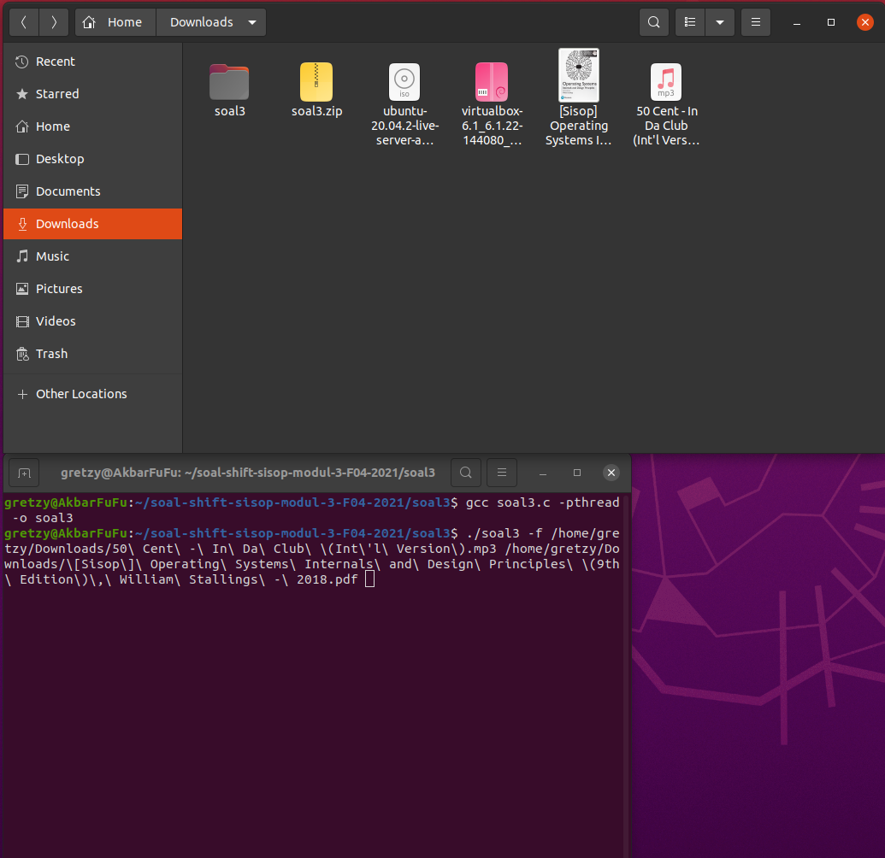

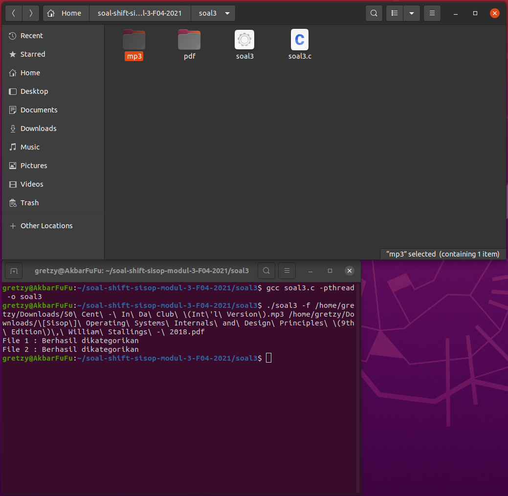

### Soal 3b
Program juga dapat menerima opsi -d untuk melakukan pengkategorian pada
suatu directory. Namun pada opsi -d ini, user hanya bisa memasukkan input 1
directory saja, tidak seperti file yang bebas menginput file sebanyak mungkin.
```c
else if (argc == 3 && strcmp(argv[1], "-d") == 0)
    {
        DIR *directory = opendir(argv[2]);
        if (directory)
        {
            struct dirent *dr;
            int thread = 0;
            while ((dr = readdir(directory)) != NULL)
            {
                if (dr->d_type == DT_REG)
                {
                    thread++;
                }
            }
            categorizeDirectory(argv[2], thread);
            closedir(directory);
            printf("Direktori Sukses disimpan!\n");
        }
        else if (ENOENT == errno)
            printf("Yah, gagal disimpan :(\n");
    }
```
Pertama akan dicek dulu opsi yang dipilih pada `argv[1]` kemudian akan membuka directory dan membacanya dan menghitung file yang ada untuk dikategorikan, selanjutnya akan memanggil fungsi `categorizeDirectory()`.
```c
void categorizeDirectory(char *folderPath, int thread)
{
    DIR *directory = opendir(folderPath);
    struct dirent *dr;
    pthread_t tid[thread];
    int count = 0;
    char fileName[400][400];

    while ((dr = readdir(directory)) != NULL)
    {
        if (dr->d_type == DT_REG)
        {
            sprintf(fileName[count], "%s/%s", folderPath, dr->d_name);
            pthread_create(&tid[count], NULL, categorizeFile, (void *)fileName[count]);
            count++;
        }
        else if ((dr->d_type == DT_DIR) && strcmp(dr->d_name, ".") != 0 && strcmp(dr->d_name, "..") != 0)
        {
            char folderPath2[400];
            sprintf(folderPath2, "%s/%s", folderPath, dr->d_name);
            DIR *directory2 = opendir(folderPath2);
            struct dirent *dr2;
            int thread2 = 0;
            while ((dr2 = readdir(directory2)) != NULL)
            {
                if (dr2->d_type == DT_REG)
                {
                    thread2++;
                }
            }
            categorizeDirectory(folderPath2, thread2);
            closedir(directory2);
        }
    }

    for (int i = 0; i < thread; i++)
        pthread_join(tid[i], NULL);
    closedir(directory);
}
```
Pada fungsi ini berfungsi untuk mencari file yang berada didalam directory. dan akan dibuatkan thread untuk dikategorikan menggunakan fungsi `categorizeFile()`. Setelah itu dilakukan `pthread_join` sejumlah thread yang ada.

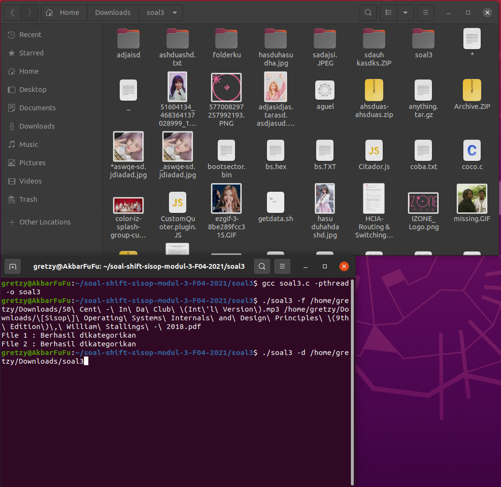

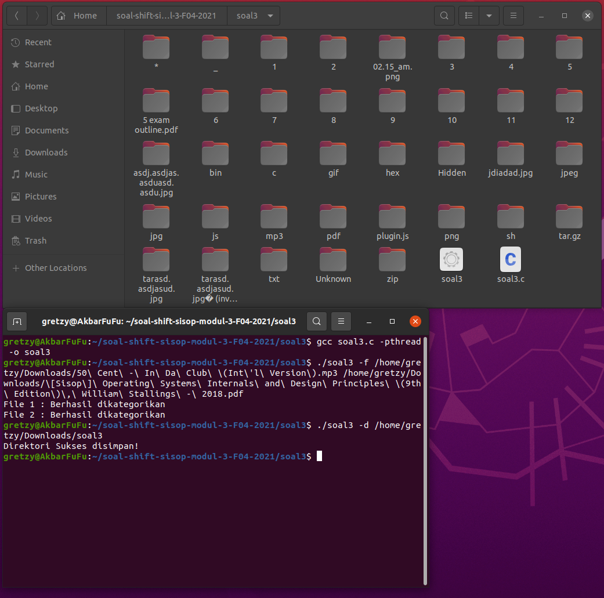

### Soal 3c
Selain menerima opsi-opsi di atas, program ini menerima opsi *, Opsi ini akan mengkategorikan seluruh file yang ada di working directory ketika menjalankan program C tersebut.
```c
    else if (argc == 2 && strcmp(argv[1], "*") == 0)
    {
        char *cwd = getenv("PWD");
        DIR *directory = opendir(cwd);

        struct dirent *dr;
        int thread = 0;
        while ((dr = readdir(directory)) != NULL)
        {
            if (dr->d_type == DT_REG)
            {
                thread++;
            }
        }
        categorizeDirectory(cwd, thread);
        closedir(directory);
    }
```
Sama persis dengan soal 3b namun direktori yang dikategorikan adalah direktori dimana program dijalankan atau *working directory*. Sehingga tidak perlu argumen tambahan berupa path directorynya.

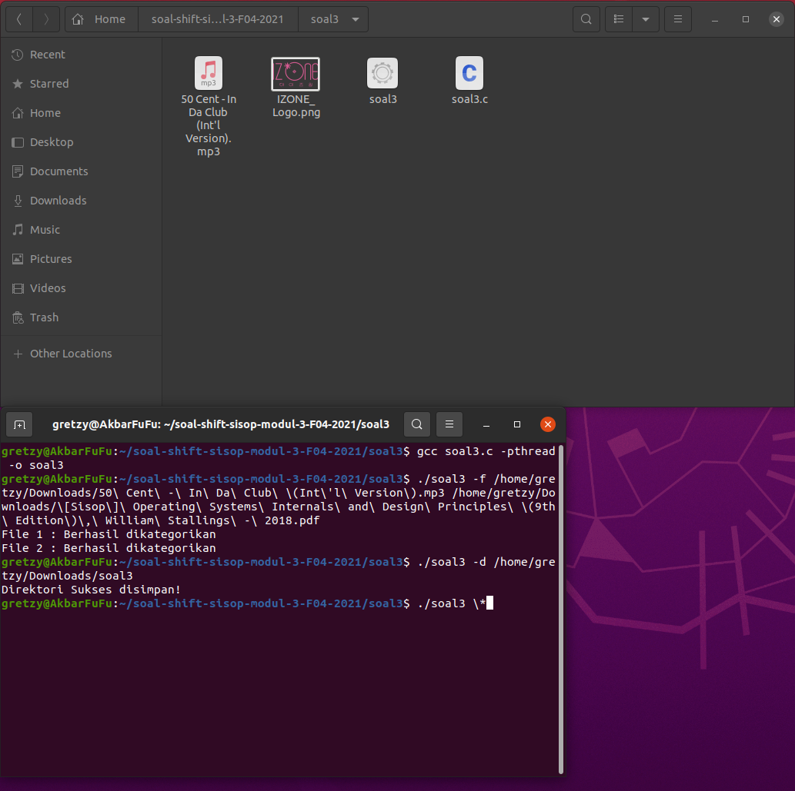

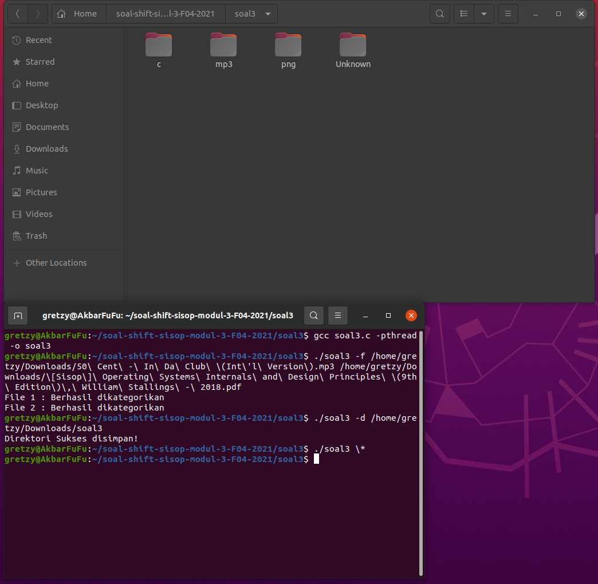

### Soal 3d
Semua file harus berada di dalam folder, jika terdapat file yang tidak memiliki ekstensi, file disimpan dalam folder “Unknown”. Jika file hidden, masuk folder “Hidden”.
```c
char *getExt(char *dir)
{
    char *unk = {"Unknown"};
    char *hid = {"Hidden"};
    char *tmp = strrchr(dir, '/');

    if (tmp[1] == '.')
        return hid;

    int i = 0;
    while (i < strlen(tmp) && tmp[i] != '.')
        i++;
    if (i == strlen(tmp))
        return unk;

    char ext[400];
    int j = i;
    while (i < strlen(tmp))
        ext[i - j] = tmp[i], i++;
    return toLower(ext + 1);
}
```
Untuk itu di cek pada fungsi ini, dimana jika nama file berawalan `.` maka merupakan hidden files. Dan jika nama file tidak ada `.` maka file tidak memiliki ekstensi.

### Soal 3e
Setiap 1 file yang dikategorikan dioperasikan oleh 1 thread agar bisa berjalan secara paralel sehingga proses kategori bisa berjalan lebih cepat.
```c
pthread_create();
```
Untuk membuat pengkategorian file berjalan pada satu thread maka, menggunakan `pthread_create` saat pemanggilan fungsi `categorizeFile()`.

#### Kendala
Kesulitan untuk mengecek apakah itu sebuah file atau folder, dan juga pengecekan hidden files.
